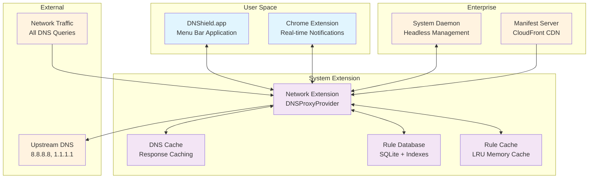
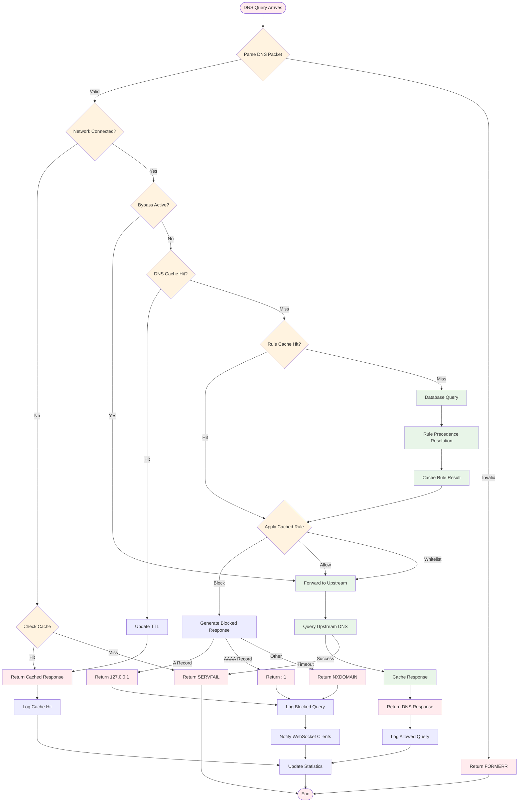
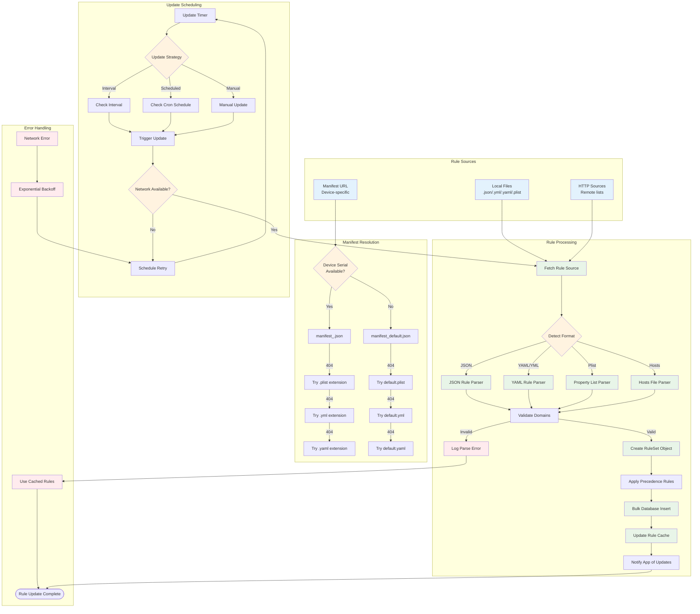
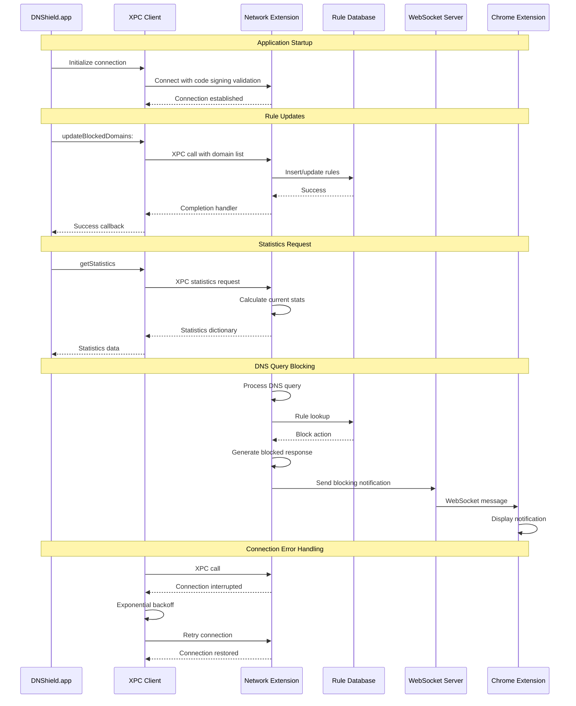
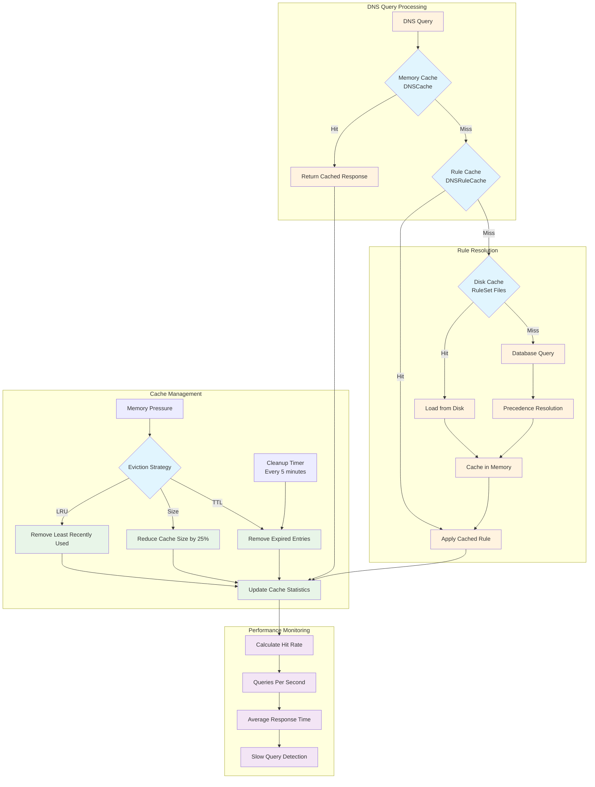
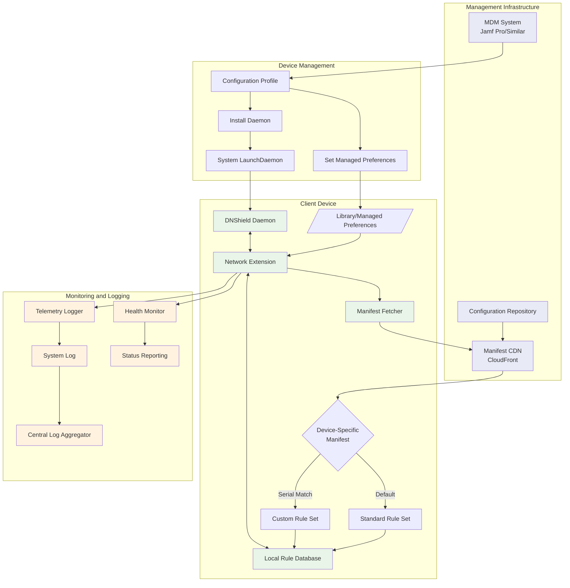
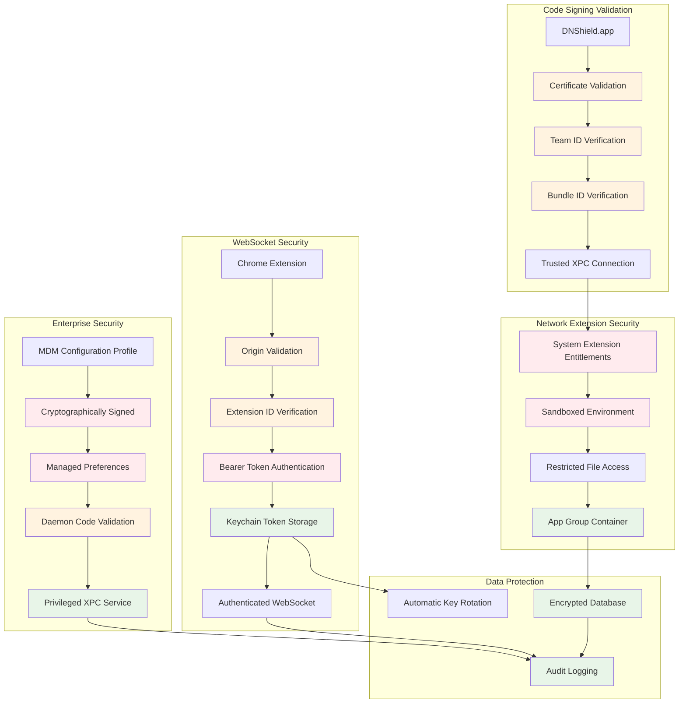

# DNShield Architecture Flow Charts and Diagrams

## 1. System Architecture Overview



## 2. DNS Query Processing Flow



## 3. Rule Management Lifecycle



## 4. XPC Communication Architecture



## 5. Cache Architecture and Data Flow



## 6. Enterprise Deployment Architecture



## 7. Security Architecture



## 8. Performance Optimization Flow

```mermaid
flowchart TD
    QueryArrival[DNS Query Arrives] --> FastPath{Fast Path Check}
    
    FastPath -->|Cache Hit| CacheReturn[Return from L1 Cache<br/>< 1ms]
    FastPath -->|Cache Miss| RulePath{Rule Cache Check}
    
    RulePath -->|Rule Hit| RuleReturn[Apply Cached Rule<br/>< 0.1ms]
    RulePath -->|Rule Miss| SlowPath[Slow Path: Database]
    
    SlowPath --> IndexedQuery[Indexed Database Query]
    IndexedQuery --> OptimizedLookup{Query Type}
    
    OptimizedLookup -->|Exact Match| ExactIndex[Use Primary Index<br/>O(1) lookup]
    OptimizedLookup -->|Wildcard| WildcardIndex[Use Wildcard Index<br/>Prefix match]
    OptimizedLookup -->|Parent Domain| ParentTraversal[Parent Domain Walk<br/>Avoid LIKE queries]
    
    ExactIndex --> CacheUpdate[Update Rule Cache]
    WildcardIndex --> CacheUpdate
    ParentTraversal --> CacheUpdate
    
    CacheUpdate --> ApplyRule[Apply Rule Action]
    ApplyRule -->|Block| FastBlock[Generate Block Response<br/>No network]
    ApplyRule -->|Allow| UpstreamQuery[Upstream DNS Query<br/>Connection pool]
    
    UpstreamQuery --> ResponseCache[Cache DNS Response<br/>TTL-aware]
    ResponseCache --> Return[Return Response]
    
    FastBlock --> Return
    CacheReturn --> UpdateMetrics[Update Performance Metrics]
    RuleReturn --> UpdateMetrics
    Return --> UpdateMetrics
    
    UpdateMetrics --> MemoryCheck{Memory Pressure?}
    MemoryCheck -->|High| CacheEviction[Evict LRU Entries<br/>25% reduction]
    MemoryCheck -->|Normal| End([Query Complete])
    
    CacheEviction --> End
    
    classDef fast fill:#c8e6c9
    classDef medium fill:#fff3e0
    classDef slow fill:#ffcdd2
    classDef optimization fill:#e1f5fe
    
    class CacheReturn,RuleReturn,FastBlock fast
    class IndexedQuery,ExactIndex,WildcardIndex medium
    class SlowPath,ParentTraversal,UpstreamQuery slow
    class CacheUpdate,ResponseCache,UpdateMetrics,CacheEviction optimization
```
