# Apple Developer Configuration Guide

This document outlines the steps for configuring App Groups, Identifiers, and Provisioning Profiles required for building and signing your macOS App and Extension.

---

## 1. App Groups

### Create an App Group

1. Navigate to [developer.apple.com](https://developer.apple.com).
2. Select **Identifiers**.
3. Open the dropdown and select **App Groups**.
   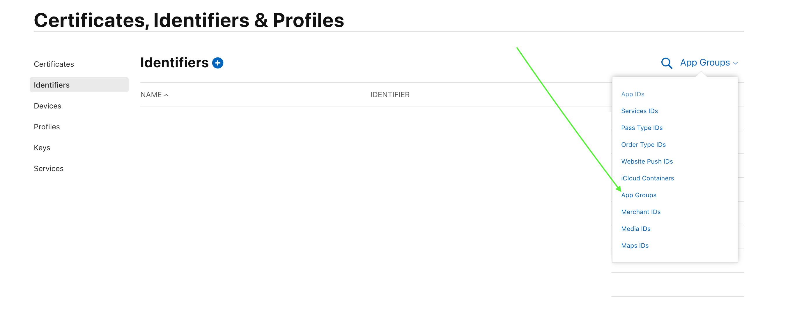

4. Click the **+** button to create a new identifier.
   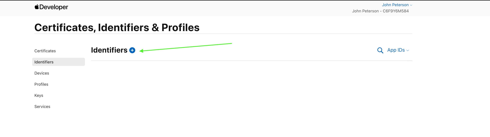

5. Click **Continue**.
6. Add a **Description** and **Identifier**, then click **Continue**.
   

7. Review and click **Register**.
   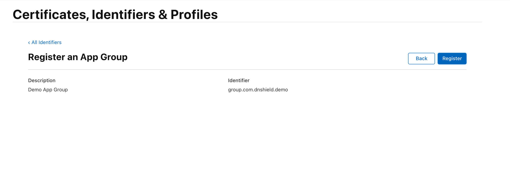

---

## 2. App Identifiers

### Create App Identifiers

1. Navigate to [developer.apple.com](https://developer.apple.com).
2. Select **Identifiers**, then click the **+** button to create a new identifier.  
   

You'll need to repeat these steps **twice** - once for the **App** and once for the **Extension**.

### Register App IDs

1. Select **App IDs** and click **Continue**.
2. On the registration screen, select **App** and click **Continue**.
   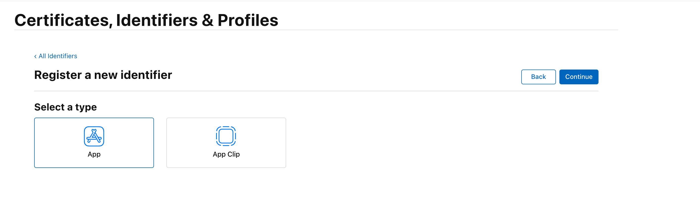

3. Fill in the **Description** and **Bundle ID** fields.
4. Under **Capabilities**, enable:

   - **App Groups**
     - _Note: You'll assign the specific App Group after creation._
   - **Network Extensions**
   - **System Extension**
     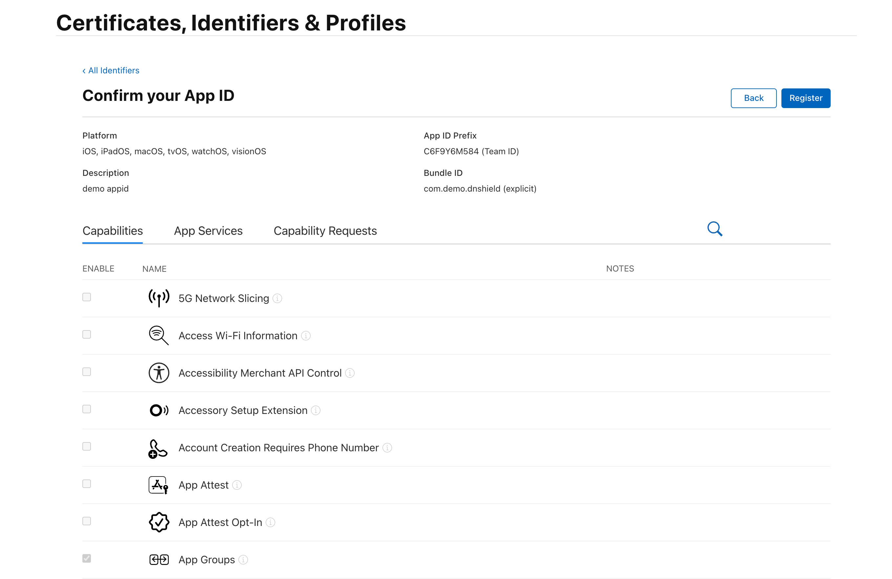

5. Click **Continue**, then **Register**.

---

## 3. Assign App Groups to Identifiers

1. Select the identifier you just created.
   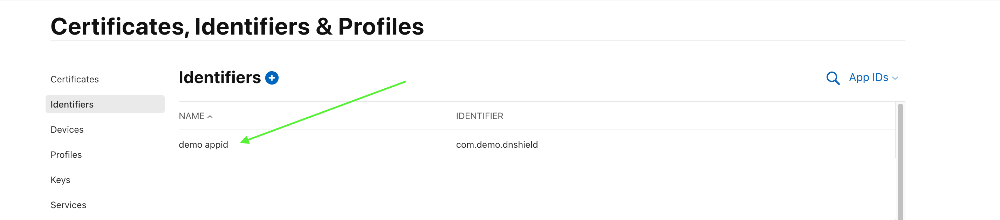

2. Click **Configure** next to **App Groups**.
   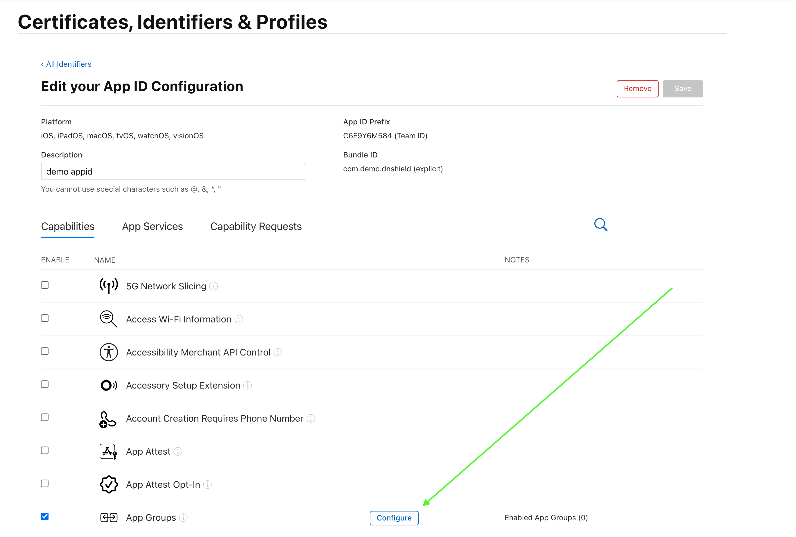

3. Select the App Group identifier you previously created, then click **Continue**.
   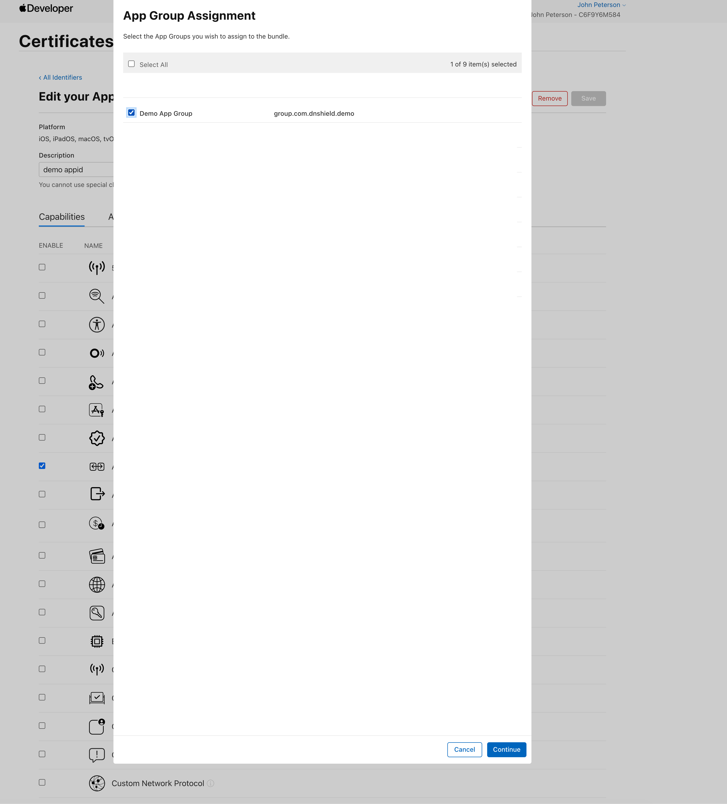

4. Confirm the modal that appears about modifying app capabilities.
   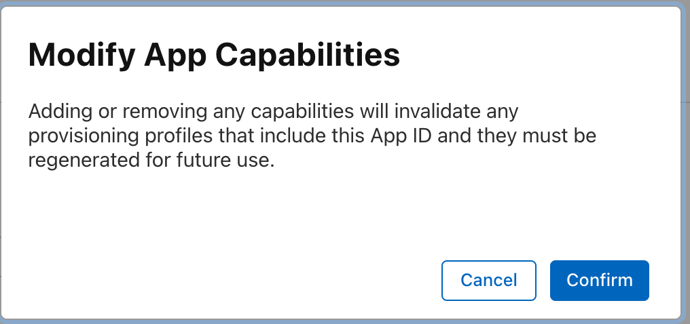

5. You should now see **Enabled App Groups (1)** on the App Groups line.
   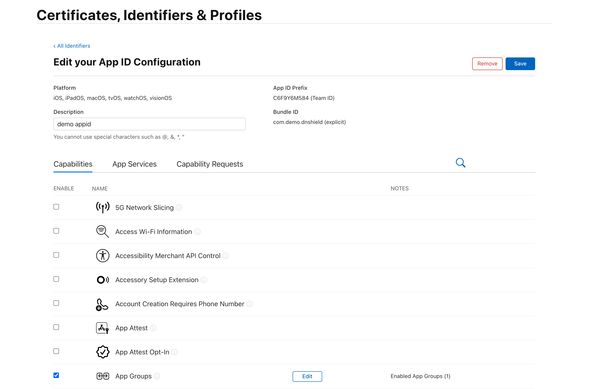

6. Click **Save**.

---

## 4. Provisioning Profiles

### Create Provisioning Profiles

1. Navigate to [developer.apple.com](https://developer.apple.com).
2. Select **Profiles**, then click the **+** button to create a new profile.
   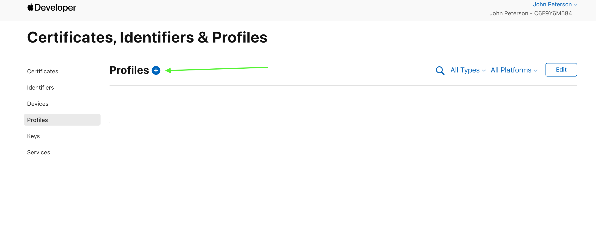
3. Choose **Distribution > Developer ID**.
   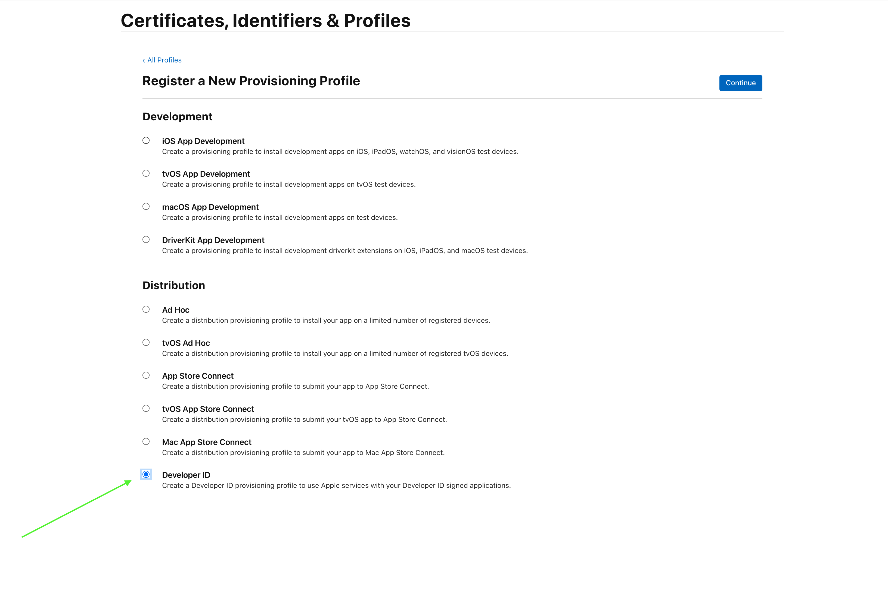
4. Select the appropriate **App ID**, then click **Continue**.
   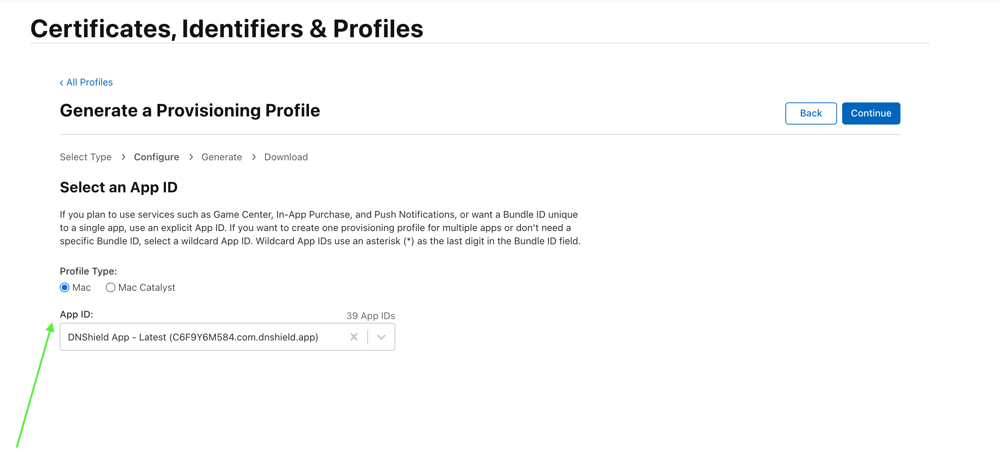
5. Choose the certificate(s) you wish to include, then click **Continue**.
   - _Tip: Add `- App` and `- Extension` to the profile names for clarity later._
     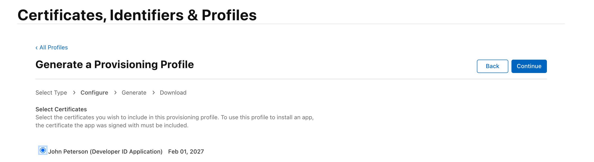
6. Click **Generate**, then **Download** once processing completes.
   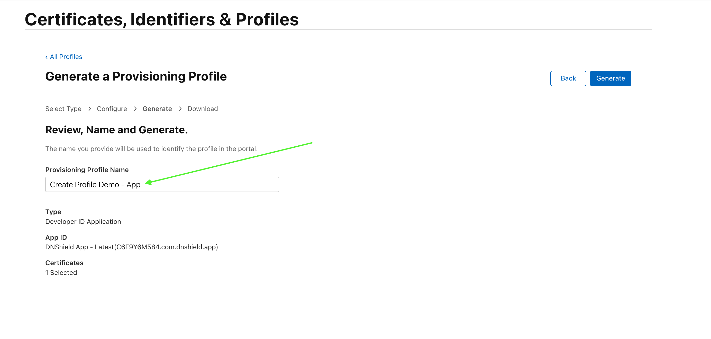
   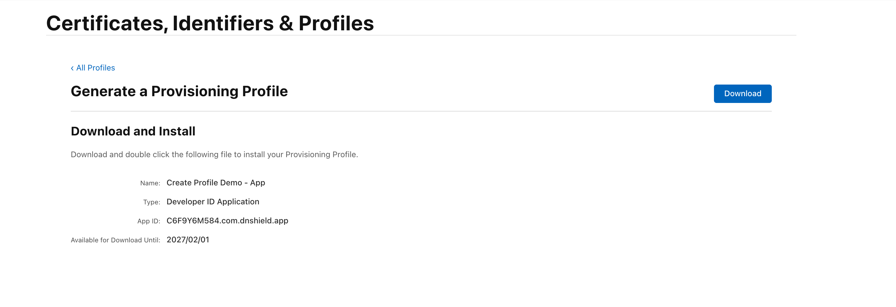

### Example Setup

### App Provisioning Profile

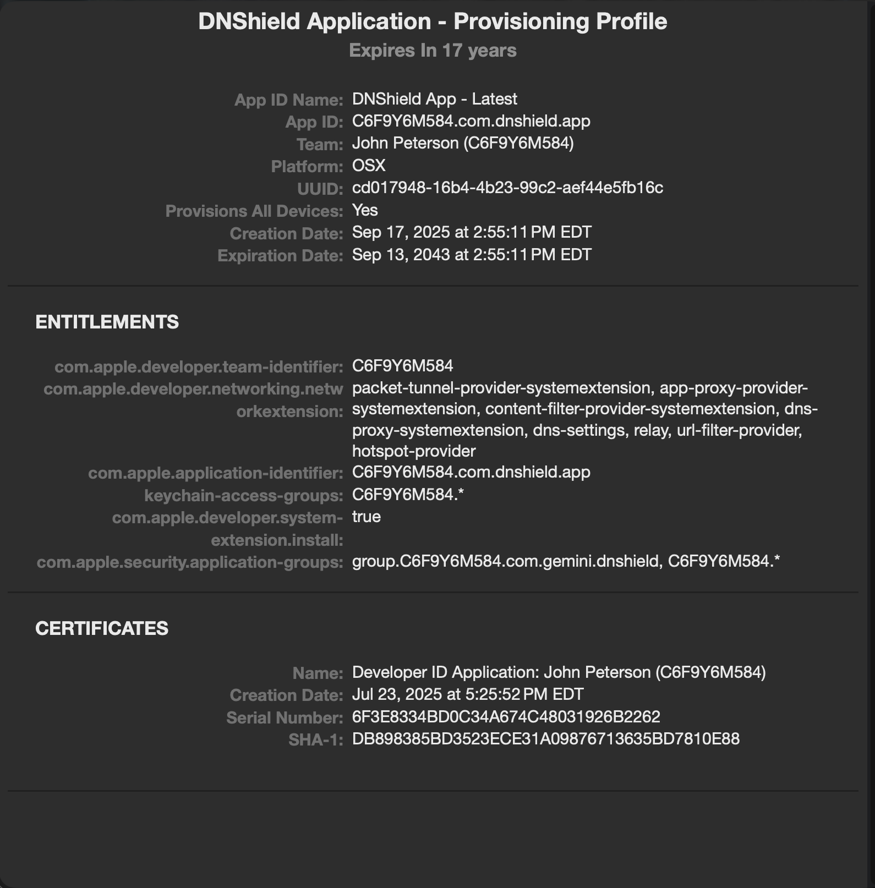

### Extension Provisioning Profile

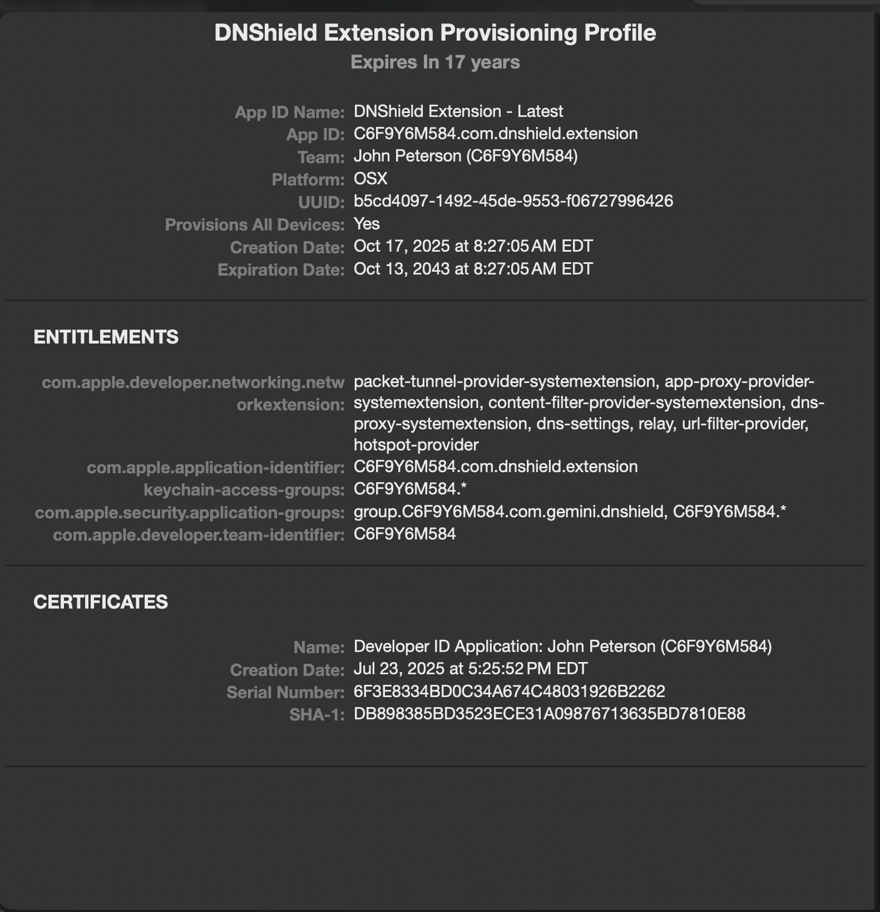

---

## 5. GitHub Workflow & Local Build Notes

If you're unsure which provisioning profile is being used (especially if multiple are installed in Xcode), you can verify during a local build.

Run:

```sh
make mac-app-enterprise
```

Then filter the output for .provisionprofile to identify the paths used for both the App and Extension.

Example: Application

```sh
ProcessProductPackaging /Users/dnshield/Library/Developer/Xcode/UserData/Provisioning\ Profiles/cd017948-16b4-4b23-99c2-aef44e5fb16c.provisionprofile /Users/dnshield/Desktop/dnshield/dnshield/build/enterprise/app/DerivedData/Build/Products/Release/DNShield.app/Contents/embedded.provisionprofile (in target 'DNShield' from project 'DNShield')
    cd /Users/dnshield/Desktop/dnshield/dnshield
    builtin-productPackagingUtility /Users/dnshield/Library/Developer/Xcode/UserData/Provisioning\ Profiles/cd017948-16b4-4b23-99c2-aef44e5fb16c.provisionprofile -o /Users/dnshield/Desktop/dnshield/dnshield/build/enterprise/app/DerivedData/Build/Products/Release/DNShield.app/Contents/embedded.provisionprofile
```

Example: Extension

```sh
ProcessProductPackaging /Users/dnshield/Library/Developer/Xcode/UserData/Provisioning\ Profiles/b5cd4097-1492-45de-9553-f06727996426.provisionprofile /Users/dnshield/Desktop/dnshield/dnshield/build/enterprise/app/DerivedData/Build/Products/Release/com.dnshield.extension.systemextension/Contents/embedded.provisionprofile (in target 'Extension' from project 'DNShield')
    cd /Users/dnshield/Desktop/dnshield/dnshield
    builtin-productPackagingUtility /Users/dnshield/Library/Developer/Xcode/UserData/Provisioning\ Profiles/b5cd4097-1492-45de-9553-f06727996426.provisionprofile -o /Users/dnshield/Desktop/dnshield/dnshield/build/enterprise/app/DerivedData/Build/Products/Release/com.dnshield.extension.systemextension/Contents/embedded.provisionprofile
```

After completing these steps:

- The App Group connects your main app and its extension.
- The Identifiers define your app capabilities.
- The Provisioning Profiles ensure proper signing for distribution and GitHub build workflows.

You are now ready to build, sign, and distribute both components using your Apple Developer configuration.
