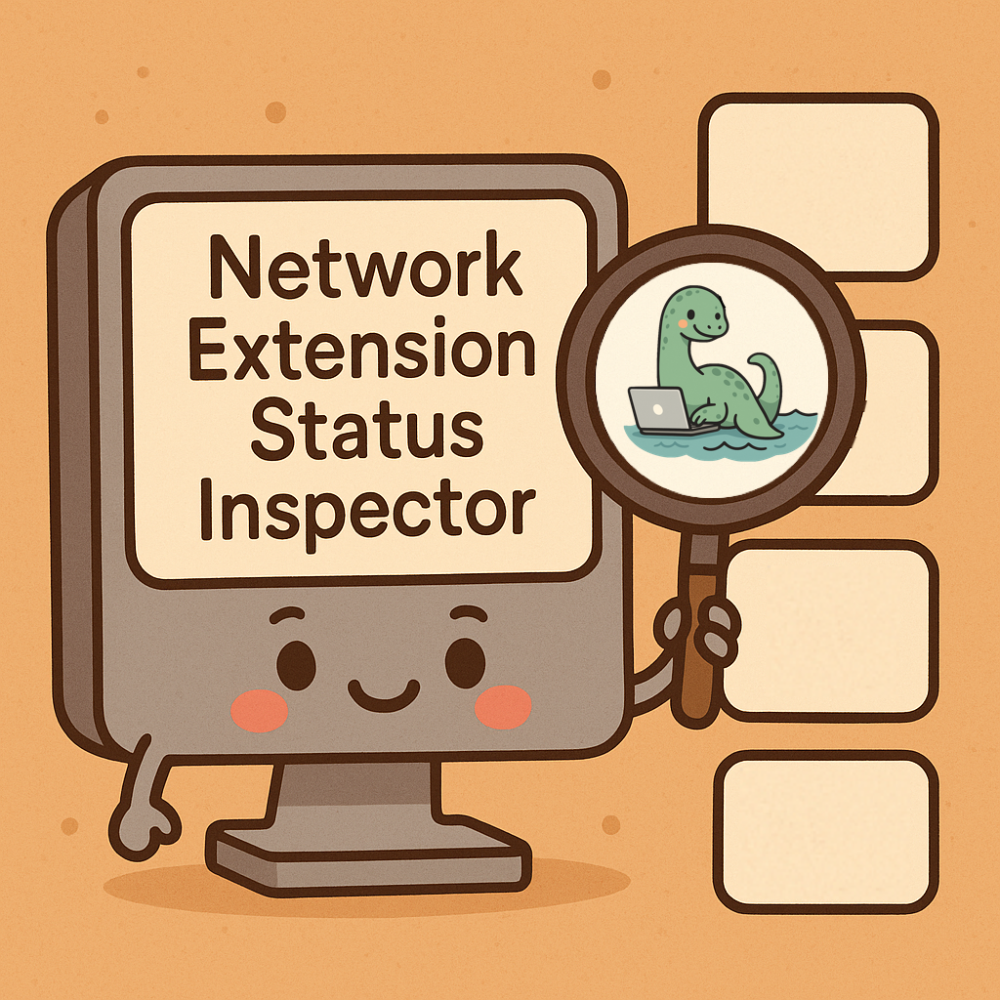

# NESI - Network Extension Status Inspector



An Objective-C port of [erikng/gnes](https://github.com/erikng/gnes) for querying macOS Network Extension configurations.

## Overview

NESI (Network Extension Status Inspector) is a command-line tool that reads and displays network extension configurations.

## Building

- Manually

```bash
clang -framework Foundation -framework NetworkExtension -o nesi main.m
```

- Makefile

```bash
make nesi
```

## Usage

### Query All Configurations

```bash
# JSON output
./nesi -dump -all -stdout-json

# XML/PLIST output
./nesi -dump -all -stdout-xml

# Raw output
./nesi -dump -all -stdout-raw
```

### List All Extension Identifiers

```bash
# JSON output
./nesi -dump -identifiers -stdout-json

# Standard output
./nesi -dump -identifiers
```

### Query Specific Extension

```bash
# Get full configuration as JSON
./nesi -identifier "com.dnshield.app" -type dnsProxy -stdout-json

# Check if enabled
./nesi -identifier "com.dnshield.app" -type dnsProxy -stdout-enabled

# Content Filter example
./nesi -identifier "com.crowdstrike.falcon.App" -type contentFilter -stdout-json

# VPN example
./nesi -identifier "com.twingate.macos" -type vpn -stdout-json
```

## Command-Line Options

```sh
OPTIONS
    -dump
        Optional: Returns requested data. Must be combined with sub-option.
        -all: Returns all found bundle identifiers and their data
        -identifiers: Returns all found bundle identifiers
        -raw: Returns all found data directly from NEConfiguration

    -identifier
        Required: The bundle identifier of the network extension to query

    -type
        Required: The type of the network extension to query
        Allowed values: "contentFilter", "dnsProxy", "vpn"

    output
        Optional: Specific output formats:
        -stdout-enabled: Returns Network Extensions enabled status
        -stdout-json: Returns Network Extension(s) data in JSON format
        -stdout-raw: Returns Network Extension(s) data in raw format
        -stdout-xml: Returns Network Extension(s) data in PLIST format
        None passed: Returns standard Network Extension(s) data
```

## Output Examples

`./nesi -identifier "com.dnshield.app" -type dnsProxy -stdout-json |jq`

```json
{
  "grade": 1,
  "dnsProxy": {
    "enabled": true,
    "protocol": {
      "designatedRequirement": "anchor apple generic and identifier \"com.dnshield.extension\" and (certificate leaf[field.1.2.840.113635.100.6.1.9] /* exists */ or certificate 1[field.1.2.840.113635.100.6.2.6] /* exists */ and certificate leaf[field.1.2.840.113635.100.6.1.13] /* exists */ and certificate leaf[subject.OU] = C6F9Y6M584)",
      "pluginType": "com.dnshield.app",
      "providerBundleIdentifier": "com.dnshield.extension"
    }
  },
  "identifier": "934BE722-7456-4812-8496-A0B0F5EDD227",
  "applicationName": "",
  "type": "dnsProxy",
  "application": "",
  "name": "DNShield DNS Proxy",
  "payloadInfo": {
    "profileIdentifier": "com.dnshield.dns-proxy-profile",
    "profileUUID": "A7D4B3C9-8E2F-4A5B-BC6D-1E9F8D7C3A2B",
    "profileIngestionDate": "2025-10-21 02:59:47 +0000",
    "profileSource": 2,
    "isSetAside": false,
    "systemVersion": "Version 26.1 (Build 25B5042k)",
    "payloadUUID": "B4E5C8D2-3F6A-4B8C-9D1E-2A7F9C5B4E3D",
    "payloadOrganization": ""
  }
```

`./nesi -identifier "com.dnshield.app" -type dnsProxy -stdout-xml`

```xml
<?xml version="1.0" encoding="UTF-8"?>
<!DOCTYPE plist PUBLIC "-//Apple//DTD PLIST 1.0//EN" "http://www.apple.com/DTDs/PropertyList-1.0.dtd">
<plist version="1.0">
<dict>
        <key>application</key>
        <string></string>
        <key>applicationName</key>
        <string></string>
        <key>dnsProxy</key>
        <dict>
                <key>enabled</key>
                <true/>
                <key>protocol</key>
                <dict>
                        <key>designatedRequirement</key>
                        <string>anchor apple generic and identifier "com.dnshield.extension" and (certificate leaf[field.1.2.840.113635.100.6.1.9] /* exists */ or certificate 1[field.1.2.840.113635.100.6.2.6] /* exists */ and certificate leaf[field.1.2.840.113635.100.6.1.13] /* exists */ and certificate leaf[subject.OU] = C6F9Y6M584)</string>
                        <key>pluginType</key>
                        <string>com.dnshield.app</string>
                        <key>providerBundleIdentifier</key>
                        <string>com.dnshield.extension</string>
                </dict>
        </dict>
        <key>grade</key>
        <integer>1</integer>
        <key>identifier</key>
        <string>934BE722-7456-4812-8496-A0B0F5EDD227</string>
        <key>name</key>
        <string>DNShield DNS Proxy</string>
        <key>payloadInfo</key>
        <dict>
                <key>isSetAside</key>
                <false/>
                <key>payloadOrganization</key>
                <string></string>
                <key>payloadUUID</key>
                <string>B4E5C8D2-3F6A-4B8C-9D1E-2A7F9C5B4E3D</string>
                <key>profileIdentifier</key>
                <string>com.dnshield.dns-proxy-profile</string>
                <key>profileIngestionDate</key>
                <string>2025-10-21 02:59:47 +0000</string>
                <key>profileSource</key>
                <integer>2</integer>
                <key>profileUUID</key>
                <string>A7D4B3C9-8E2F-4A5B-BC6D-1E9F8D7C3A2B</string>
                <key>systemVersion</key>
                <string>Version 26.1 (Build 25B5042k)</string>
        </dict>
        <key>type</key>
        <string>dnsProxy</string>
</dict>
</plist>
```

### Enabled Status Output

```bash
$ ./nesi -identifier "com.dnshield.app" -type dnsProxy -stdout-enabled
true
```

### As a munki conditional

Use [nesi-status](munki/nesi-status.go) to set a key/value pair munki can use for conditional checks.

## Credits

This is an Objective-C port of [gnes](https://github.com/erikng/gnes) by Erik Gomez.

Original blog post: [Introducing gnes - Reverse engineering the NetworkExtension API](https://blog.eriknicolasgomez.com/2022/03/16/Introducing-gnes-Reverse-engineering-the-NetworkExtension-API/)
